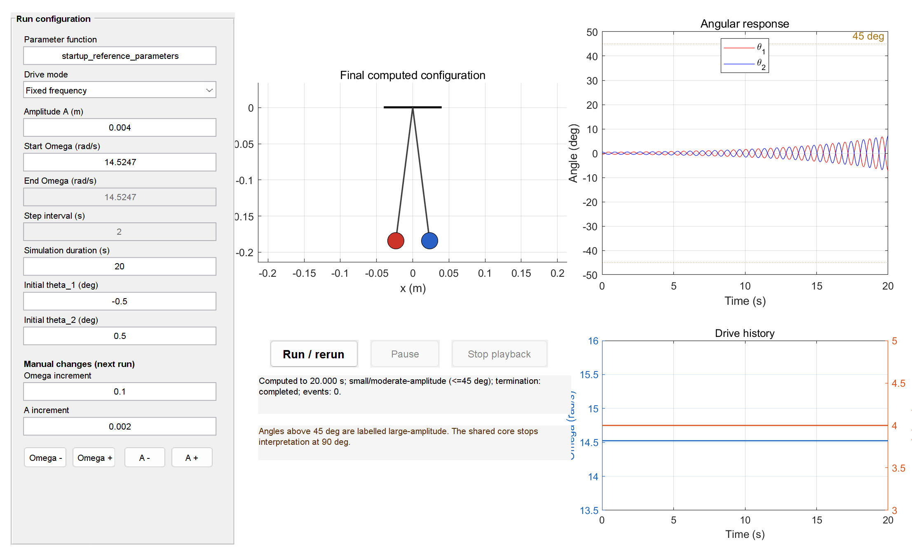

# Lato-Lato Dynamics: Hybrid Simulation, Floquet Theory & Virtual Experiment Toolkit

[](https://www.mathworks.com/products/matlab.html)
[](https://opensource.org/licenses/MIT)
[](#)
[](#)

> **A comprehensive MATLAB simulation suite for modeling parametric resonance, hybrid collision dynamics, string slackness, and Floquet startup instability of the Lato-lato (Clackers) toy.**

---

## 📖 Overview

**Lato-lato** (also known as *Clackers*, *Tik-Tok balls*, or *Newton's Yo-yo*) is a classic mechanical toy consisting of two rigid spheres suspended by flexible cords from a common pivot. When subject to vertical periodic hand driving, the system exhibits rich non-linear phenomena: small-angle parametric resonance startup, finite-time string slackness, unilateral elastic/inelastic collisions, anti-phase synchronization, and stable top-and-bottom clacking limit cycles.

This repository hosts the official open-source MATLAB simulation codebase accompanying the paper:
> *"Dynamics, Floquet Instability, and Hybrid Collision Modeling of Lato-Lato under Parametric Excitation"*

The package provides a complete pipeline from analytical Floquet theory to high-fidelity hybrid numerical integration and an interactive virtual experiment GUI.



---

## ✨ Key Features

- **Hybrid Dynamical Simulation Engine (`+lato/simulate_hybrid.m`)**:
  - Event-driven adaptive `ode45` integration.
  - Precise detection of sphere-sphere collision events with restitution coefficient $e_{\text{ball}}$.
  - String slackness tracking and radial re-tensioning impact with restitution $e_{\text{restring}}$.
  - Aerodynamic drag modeling (Schiller–Naumann empirical Reynolds drag or constant $C_d$).
  - Inelastic chatter suppression and capture mechanics.

- **Analytical & Numerical Floquet Startup Theory (`+lato/+theory/`)**:
  - Small-angle Mathieu-type parametric excitation analysis.
  - Floquet exponent / growth rate calculations ($\mu / \omega_0$).
  - Analytical averaged startup boundary formulation and high-precision numerical boundary refinement.
  - Generation of $(\Omega/\omega_0, A\Omega^2/g)$ stability phase diagrams.

- **High-Throughput Multi-Parameter Scans (`+lato/+scan/`)**:
  - Automated grid exploration across drive amplitude $A$, string length $L$, drive frequency $\Omega$, and initial opening angle $\theta_{\text{seed}}$.
  - Checkpoint and resume support for computationally intensive batch runs.
  - Multi-panel 2D heatmaps and 3D response surface visualization (`+lato/+plot/`).

- **Interactive Virtual Experiment App (`gui/lato_gui.m`)**:
  - Intuitive graphical interface for interactive experimentation and educational demonstrations.
  - Real-time animated pendulums with dynamic cord tension/slack states.
  - Multiple drive modes: Fixed frequency, continuous frequency chirp/sweep, and discrete step frequency schedules.
  - Live phase portraits $(\theta, \dot{\theta})$, Poincaré sections, energy budgets, and clacking frequency tracking.

---

## 📁 Repository Structure

```text
Lato_Code/
├── GUI_experiment.png           # Screenshot preview of the interactive GUI
├── README.md                    # Project documentation (this file)
└── CODE/
    ├── setup_lato.m             # One-click environment setup script
    ├── configs/                 # Simulation parameter configurations
    │   ├── paper_parameters.m   # Baseline experimental & manuscript parameters
    │   └── startup_reference_parameters.m # Collision-suppressed reference set
    ├── gui/                     # Graphical User Interface
    │   └── lato_gui.m           # Interactive virtual experiment application
    ├── scripts/                 # Entry points for reproducing manuscript figures
    │   ├── make_F1_mechanism_timeline.m     # Fig 1: Single-run hybrid timeline
    │   ├── make_F2_startup_phase_diagram.m  # Fig 2: Floquet onset phase diagram
    │   └── make_F7_startup_cross_maps.m     # Fig 7: Multi-parameter cross-space maps
    └── +lato/                   # Core modular package
        ├── simulate_hybrid.m    # Event-driven hybrid ODE solver
        ├── validate_parameters.m# Parameter integrity and physical bounds checker
        ├── compute_energy.m     # Kinetic, potential, and dissipated energy
        ├── compute_metrics.m    # Cycle extraction, collision detection & metrics
        ├── assess_stability.m   # Limit-cycle and anti-phase stability testing
        ├── poincare_samples.m   # Stroboscopic Poincaré sampling
        ├── estimate_phase_locking.m
        ├── estimate_response_frequency.m
        ├── +drive/              # Drive kinematics (harmonic, sweep, step)
        ├── +theory/             # Floquet stability, averaged boundary, growth rates
        ├── +scan/               # Grid and pairwise parameter scanning engines
        └── +plot/               # Publication-quality plotting routines
```

---

## 🚀 Quick Start

### 1. Requirements
- **MATLAB R2021a** or later (tested on R2021a–R2024b).
- Base MATLAB installation is sufficient (uses built-in `ode45`, `exportgraphics`, and standard UI components; **no additional commercial toolboxes required**).

### 2. Setup
Clone the repository and initialize the MATLAB path:

```matlab
% Navigate to the CODE directory
cd('path/to/Lato_Code/CODE');

% Add required subdirectories to the MATLAB path
setup_lato;
```

---

## 🧪 Reproducing Paper Results

All manuscript figures can be reproduced directly by executing the dedicated scripts in `CODE/scripts/`:

### 1. Hybrid Mechanism Timeline (Figure 1)
Simulates a single 20-second hybrid run and plots state trajectories, string tensions, collision impulses, and energy dissipation:
```matlab
make_F1_mechanism_timeline;
```
- Output files are saved to `CODE/results/` and figures to `CODE/figures/F1_mechanism_timeline.*`.

### 2. Floquet Startup Instability Phase Diagram (Figure 2)
Computes the small-angle Floquet growth rate $\mu / \omega_0$ on a dense $(\Omega/\omega_0, h = A\Omega^2/g)$ grid, locates the parametric resonance tongue, and extracts numerical/analytical threshold boundaries:
```matlab
make_F2_startup_phase_diagram;
```
- Outputs high-resolution vector PDFs and PNGs into `CODE/figures/F2_startup_phase_diagram.*` along with `.csv` data tables.

### 3. Startup Cross-Parameter Maps (Figure 7)
Explores finite-time startup responses across pairwise parameter combinations ($(A, \Omega)$, $(L, \Omega)$, and $(\theta_{\text{seed}}, \Omega)$):
```matlab
make_F7_startup_cross_maps;
```
> *Tip: For a rapid preliminary verification, edit `formalMode = false` inside `make_F7_startup_cross_maps.m` to run a fast $13 \times 13$ preview grid before launching the full $51 \times 51$ high-resolution scan.*

---

## 🎮 Interactive Virtual Experiment (GUI)

Launch the interactive app by executing:

```matlab
lato_gui;
```

### Interface Highlights:
1. **Simulation Control & Modes**:
   - **Fixed Frequency**: Set fixed drive frequency $\Omega$ and amplitude $A$.
   - **Continuous Sweep (Chirp)**: Linear or smooth frequency ramp-up/ramp-down to observe frequency locking and hysteresis.
   - **Step Sweep**: Discrete frequency stepping across specified intervals.
2. **Real-Time Physics Display**:
   - Animated visual pendulum displaying taut (solid line) vs. slack (dashed line) cord states, ball positions, and pivot motion.
   - Real-time trajectory tracing and impact flash indicators.
3. **Diagnostics & Analysis Panes**:
   - Phase-space trajectories $(\theta_1, \dot{\theta}_1)$ and $(\theta_2, \dot{\theta}_2)$.
   - Dynamic tension indicators and mechanical energy dissipation breakdown.
   - Stroboscopic Poincaré map sectioning.

---

## ⚙️ Configuration & Customization

Simulation parameters are centralized in `CODE/configs/paper_parameters.m`. Key editable parameters include:

| Parameter | Symbol | Default Value | Description |
| :--- | :---: | :---: | :--- |
| `p.mass` | $m$ | `0.100 kg` | Mass of each ball |
| `p.radius` | $r$ | `0.012 m` | Radius of each ball |
| `p.ell` | $L$ | `0.186 m` | Cord length (pivot to ball center) |
| `p.e_ball` | $e_b$ | `0.822` | Ball-to-ball coefficient of restitution |
| `p.e_restring` | $e_r$ | `0.900` | Radial coefficient of restitution upon cord re-tension |
| `p.beta` | $\beta$ | `0.160 s^-1`| Viscous damping coefficient |
| `p.drive.amplitude`| $A$ | `0.020 m` | Pivot vertical excitation amplitude |
| `p.drive.omega` | $\Omega$ | `15.0 rad/s` | Pivot vertical excitation frequency |
| `p.air.model` | - | `"schiller-naumann"` | Aerodynamic drag model (`"schiller-naumann"` or `"constant"`) |

Custom drive schedules (e.g., custom ramps, non-sinusoidal waveforms) can be integrated by assigning a custom function handle to `p.drive.function`.

---

## 📜 Citation & License

This project is licensed under the **MIT License** - see the LICENSE file for details.

If you use this codebase, models, or GUI in your academic research or teaching, please cite our paper:

```bibtex
@article{lato_lato_ajp2026,
  title   = {Dynamics, Floquet Instability, and Hybrid Collision Modeling of Lato-Lato under Parametric Excitation},
  journal = {American Journal of Physics},
  year    = {2026},
  note    = {MATLAB Simulation Toolkit and Supplemental Code}
}
```

---

## 🤝 Contributing & Feedback

Issues, pull requests, and suggestions are welcome! For questions regarding theoretical derivations or simulation routines, feel free to open an issue or contact the authors.
